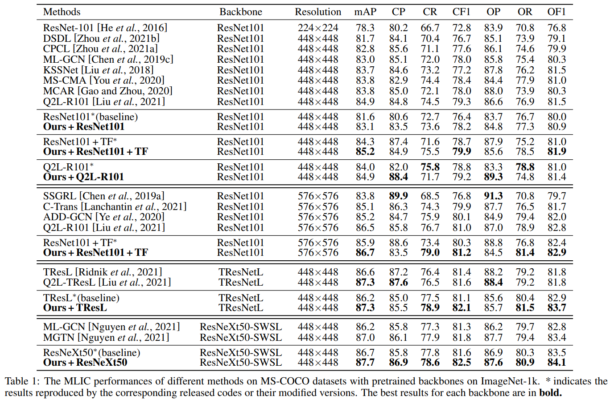
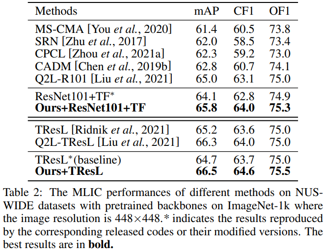

# Introdunction
PyTorch implementation of [Boosting Multi-Label Image Classification with Complementary Parallel Self-Distillation](https://arxiv.org/abs/2205.10986), IJCAI 2022.

## Abstract

Multi-Label Image Classification (MLIC) approaches usually exploit label correlations to achieve good performance. However, emphasizing correlation like co-occurrence may overlook discriminative features of the target itself and lead to overfitting, thus undermining the performance. In this study, we propose a generic framework named Parallel Self-Distillation (PSD) for boosting MLIC models. PSD decomposes the original MLIC task into several simpler MLIC sub-tasks via two elaborated complementary task decomposition strategies named Co-occurrence Graph Partition (CGP) and Dis-occurrence Graph Partition (DGP). Then, the MLIC models of fewer categories are trained with these sub-tasks in parallel for respectively learning the joint patterns and the category-specific patterns of labels. Finally, knowledge distillation is leveraged to learn a compact global ensemble of full categories for reconciling the label correlation exploitation and model overfitting. Extensive results on MS-COCO and NUS-WIDE datasets demonstrate that our framework can be easily plugged into many MLIC approaches and improve performances of recent state-of-the-art approaches. The explainable visual study also further validates that our method is able to learn both the category-specific and co-occurring features.


## Results on MS-COCO:


## Results on NUS-WIDE:


# Requirements
Following packages are recommended
- numpy
- torch-1.9.0
- torchvision-0.10.0
- tqdm
- environments for different models(q2l, TResNet, etc.)


# Quick start
For a detailed description of parameters, use 'python3 file.py -h'
1. Partition
We give our files after partition in ./data/, and provide the partition code in ./partition/ .

2. Train teachers
```sh
e.g.
python3 train_B_part.py --data ./data/coco --dataset coco --part 0 --num-classes 80 --subnum 1 --typ cluster --model 101 --metric mse
```

3. Train compact student
```sh
e.g.
python3 dis_B_cpsd.py --data ./data/coco --dataset coco -t q2l -s q2l --num-classes 80 --subnum 5 --model-root ./checkpoint/ --metric mse
```

# Pretrianed Models
## Download pretrained models.
|  Modelname   | mAP | link(Google drive)  | 
|  ----  | ----  | ----  
| CPSD-R101-448-COCO  | 83.1 | [link](https://drive.google.com/file/d/1Kgz08VDiatX9OFhuCPyFIoSehxfMdqjl/view?usp=sharing) |
| CPSD-Q2L-448-COCO  | 84.9 | [link](https://drive.google.com/file/d/1NZ4-VKcaBC72X_EbhrAeC6yLk6FOUIjm/view?usp=sharing) |
| CPSD-R101TF-448-COCO  | 85.2 | [link](https://drive.google.com/file/d/1UZTecEBc2m1MRX9m_adYwKi-y1xZdtqq/view?usp=sharing) |
| CPSD-R101TF-576-COCO  | 86.7 | [link](https://drive.google.com/file/d/1sBStYtAzAYAfeT1xTVLRmd05BlhjsrRn/view?usp=sharing) |
| CPSD-TResNet-448-COCO  | 87.3 | [link](https://drive.google.com/file/d/1y6BiBH000IOzADNlDmtcXczEIXk5sRvq/view?usp=sharing) |
| CPSD-ResNeXt-448-COCO  | 87.7 | [link](https://drive.google.com/file/d/1RSYgykqLRHlqRobFvW6Ak3UXOVSnW7nH/view?usp=sharing) |
| CPSD-R101TF-448-NUS  | 65.8 | [link](https://drive.google.com/file/d/1YMZR3NKPJ6muR6L6UikdJemwfrjVTIkj/view?usp=sharing) |
| CPSD-TResNet-448-NUS  | 66.5 | [link](https://drive.google.com/file/d/1n1M4x9gvnkjIBuey3MMgcV2x9iKV7_23/view?usp=sharing) |

## Test pretrained models
```sh
e.g.
python3 validate.py --model 101tf --dataset nuswide --resume ./checkpoint/dis_nus_combine_101tf2101tf_partition0_cl5_mse_55-65.80161317536648-42.ckpt
```

# Acknowledgement
We thank the authors of [Q2L](https://github.com/SlongLiu/query2labels), [ASL](https://github.com/Alibaba-MIIL/ASL), [TResNet](https://github.com/Alibaba-MIIL/TResNet), [ML-GCN](https://github.com/Megvii-Nanjing/ML-GCN), [C-Tran](https://github.com/QData/C-Tran) for their great works and codes.
